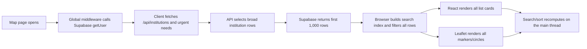
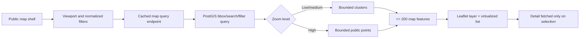

# DajSrce project-wide audit and optimization plan

**Audit date:** 2026-08-01

**Repository:** `dajsrce`

**Audit type:** read-only source, configuration, database, artifact, build, dependency, and production-safe performance review
**Primary objective:** make the application fast with a nationwide location catalogue, then remove the architectural, correctness, security, accessibility, design, and operational risks that would otherwise prevent safe growth.

> **Implementation update (2026-08-01):** the repository remediation described by this audit has been implemented. See `REMEDIATION_IMPLEMENTATION_STATUS.md` for the finding-by-finding disposition, validation evidence and mandatory staging/production gates. See `TECHNICAL_IMPLEMENTATION.md` for the current architecture and release/incident runbooks. The measurements and “current” flows below intentionally remain as the pre-fix baseline.

---

## 1. Executive verdict

DajSrce is slow because its current map flow treats the full institution catalogue as a small static list. A visit to the production map downloads the broad institution record for the first 1,000 rows, creates 1,000 React/Leaflet marker components, creates the corresponding list cards, and performs search, filtering, sorting, and distance calculations in the browser. The endpoint is uncached and the global authentication middleware also performs a remote user lookup on public requests. This is a scaling model problem, not a single slow function.

Measured on 2026-08-01, the production `/api/institutions` response was approximately **2.53 MB uncompressed**, contained exactly **1,000 records**, took **4.4-5.6 seconds** in repeated uncached requests, and returned `Cache-Control: public,max-age=0,must-revalidate` with an edge cache miss. A compressed request still transferred about **557 KB** and had approximately **1.94 seconds time to first byte**. The rendered default map created roughly **18,700 DOM elements**, **1,000 Leaflet marker objects**, and over **1,000 buttons**. This volume also makes the accessibility tree unusually expensive. Filtering to a single distinctive result reduced the DOM to approximately 144 elements, demonstrating that result cardinality is the dominant browser-side cost.

The correct end state is a viewport-driven geospatial service: send only clusters or the small set of visible, public-safe points for the current bounding box and zoom, return a lightweight map DTO, load details on demand, virtualize the result list, and cache public queries. The browser must never receive or render the entire national catalogue merely to show one viewport.

There are also several **release-blocking authorization issues**. Most importantly, an unauthenticated seed endpoint can delete and recreate institution data; profile row-level security allows a user to change their own privileged role and institution association; company membership and company update policies permit privilege or subscription forgery through direct Supabase access; and hidden institutions' exact coordinates are exposed by public reads. These must be fixed before promotional growth or performance-driven traffic increases.

The project does have a viable foundation: TypeScript strict checking passes, the production build succeeds, the product has coherent donation, volunteering, company, reporting, and localization concepts, and the database already uses migrations and row-level security. The work below is an evolution of that foundation, not a rewrite.

### Recommended order

1. **Security release gate:** close destructive and privilege-escalation paths, protect sensitive locations and tokens, and patch vulnerable dependencies.
2. **Location performance path:** add geospatial indexes and APIs, lightweight public projections, server-side search/filtering, clustering, caching, cancellation, and list virtualization.
3. **Transactional correctness:** make pledges, counters, signups, verification, billing, acknowledgements, and artifact versioning atomic and idempotent.
4. **Data quality and ingestion:** normalize organizations/contacts, deduplicate source files, repair classification and trust semantics, and replace row-by-row imports with staged bulk jobs.
5. **Architecture and operations:** consolidate domains, generate database types, validate inputs, add background jobs, observability, testing, CI, and recovery procedures.
6. **Product quality:** finish localization, accessibility, privacy consent, document accuracy, responsive states, and visual trust cues.

---

## 2. Scope, method, and limitations

### Reviewed

- The complete project file inventory outside generated/vendor directories (`node_modules`, `.next`, `.git`, and `.vercel`).
- Application routes, API routes, components, libraries, localization, scripts, migrations, configuration, environment templates, and package manifests.
- All project Markdown/text documentation and all supplied Word, PDF, and spreadsheet planning/research artifacts.
- The schema and row-level security policies represented by migrations in the repository.
- Production-safe GET requests and browser inspection of the deployed application; no production data was modified.
- Type checking, a production build, dependency vulnerability and staleness reports, and the configured lint command.
- Visual rendering of all PDF pages and all worksheet tabs. Word files were structurally extracted and reviewed in full; page-perfect Word rendering could not be run because LibreOffice is not installed in the workspace runtime. One Word deliverable also had an existing PDF representation which was visually checked.

### Repository scale observed

After excluding dependency and build output, the project contains about **211 files**. The largest code areas are approximately:

| Area | Files | Lines | Main responsibility |
|---|---:|---:|---|
| `src/app` | 43 | 6,600 | App Router pages and API handlers |
| `src/components` | 24 | 4,838 | Client UI and workflows |
| `src/lib` | 37 | 4,685 | Supabase, company, reporting, receipt, and domain helpers |
| `src/app/api` | 45 | 4,137 | Public and authenticated server endpoints |
| `supabase` SQL | 18 | 1,953 | Schema, RLS, reporting, registry, and verification |
| `scripts` | 15 | 1,756 | Registry ingestion, geocoding, promotion, and maintenance |

### Important audit boundaries

- Findings about database authorization are based on checked-in migrations. Before fixing them, compare the deployed database policies with the migration state using a read-only schema dump; production may have drifted.
- External email delivery, Stripe settlement, Supabase dashboard configuration, backups, DNS, and third-party account settings were not mutated or exhaustively penetration-tested.
- Tax, receipt, ESG/VSME, data-retention, and safe-house disclosure requirements need review by Croatian legal/privacy/accounting specialists. This document identifies engineering and evidence risks; it is not legal certification.
- Production timings are point-in-time measurements from Europe/Zagreb and should become a repeatable baseline in CI and monitoring rather than be treated as a permanent benchmark.

---

## 3. Current architecture and request flow

### Technology

- Next.js 15 App Router, React 19, TypeScript strict mode, Tailwind CSS 4.
- Supabase authentication, Postgres, row-level security, and Storage.
- Leaflet and `react-leaflet` for the institution map.
- Stripe for company subscriptions, Resend for email, and server-side generation of CSR/ESG exports and donation receipts.
- Croatian and English dictionaries, selected through a cookie.
- A nationwide NGO registry pipeline which imports, geocodes, classifies, and promotes records into the public institution table.

### Current location path



This design has four multiplicative costs:

1. **Database and network:** a `select(*)`-style public catalogue response, no viewport, no useful projection, no pagination contract, and no shared cache.
2. **Server/authentication:** middleware performs an authenticated user round-trip even for public routes and public APIs; root cookie access also makes the route tree dynamic.
3. **Browser computation:** every query scans/ranks the catalogue; geographic distance can be recalculated inside sort comparators and cards.
4. **Rendering/accessibility:** every result becomes both a card and an interactive Leaflet layer. The browser and assistive-technology trees scale linearly with the national dataset.

### Other core domains

- **Institutions/needs:** public discovery, institution dashboards, need publishing, pledge matching, and acknowledgement.
- **Volunteering:** events, signups, check-in/out, company attribution, and volunteer-hour aggregation.
- **Companies:** multi-member organizations, campaigns, subscriptions, verification, reports, exports, receipts, public profiles, and embeds.
- **Registry ingestion:** CSV/data import, geocoding, rule-based eligibility/category mapping, and promotion to institutions.
- **Evidence/reporting:** audit log, CSR reports, ESG datapoints, CSV/JSON exports, and donation receipt packs.

Two overlapping company models remain in the codebase: a legacy profile/company-action path and the newer `companies`/`company_members` multi-tenant path. There are also overlapping NGO/institution dashboards. This duplication creates inconsistent authorization and evidence semantics and should be retired deliberately rather than extended.

---

## 4. Evidence baseline

### Production endpoint and browser measurements

| Measurement | Observed value | Why it matters |
|---|---:|---|
| `/api/institutions` rows | 1,000 exactly | The catalogue is silently truncated at the Supabase response cap; locations after the cap cannot be discovered. |
| Uncompressed response | 2,530,221 bytes | Much of the payload is not required to draw the map. |
| Compressed transfer | ~556,574 bytes | Compression helps bandwidth but not database work, JSON parsing, allocation, or rendering. |
| Repeated uncached duration | 4.387-5.626 s | The public entry path is materially slow before rendering begins. |
| Compressed TTFB | ~1.944 s | Server/data access is a major share of perceived latency. |
| Cache | `max-age=0`, edge MISS | Identical public requests do not benefit from CDN reuse. |
| Default Leaflet layers | ~1,000 | The map cost grows with the full catalogue, not with what is visible. |
| Default DOM elements | ~18,678 | Layout, style, events, memory, screenshots, and accessibility all suffer. |
| Default buttons | ~1,029 | The accessibility and keyboard surface is unmanageably large. |
| After unique search | ~144 DOM elements, 1 marker | Confirms the page becomes healthy when result cardinality is bounded. |

### Production data quality sample

Within the first 1,000 returned institutions:

- 976 were unverified and 24 were verified.
- 967 were registry-derived and only 33 appeared curated.
- Several organizations clearly outside the intended support categories were classified as disability or elderly organizations because keyword rules are too permissive.
- Exact duplicate organization-name groups and coordinate hotspots were present.
- The UI gives registry-derived, unverified entries nearly the same visual weight as confirmed participants.

The issue is therefore both volume and trust. Loading more rows through the same endpoint would worsen performance and expose more low-confidence results; the solution must improve retrieval and data semantics together.

### Build and dependency baseline

- `npm exec tsc --noEmit` passes.
- `npm run build` succeeds in about 63 seconds; compilation was about 30 seconds in the audit environment.
- All application routes are currently dynamic.
- Shared first-load JavaScript is approximately 102 KB. Notable routes include map ~285 KB, needs ~358 KB, institution detail ~357 KB, volunteer ~183 KB, and login/register ~169-170 KB.
- `NeedCard` and `InstitutionCard` use wildcard imports from `lucide-react`, which prevents effective icon-level tree shaking and contributes to the unusually large needs/detail bundles.
- `npm run lint` does not provide a usable non-interactive check: it invokes deprecated/invalid `next lint` behavior and prompts for configuration because no working ESLint setup is committed.
- The production dependency audit reported seven known vulnerabilities: four high and three moderate. The installed Next.js version is affected by several security advisories and should be upgraded to a patched 15.5.x release before broader framework upgrades are considered.

### Planning/research artifact integrity

The supplied artifacts are useful product inputs, but they are not yet reliable as generated evidence:

- The CSR summary shows total investment of 682,014 in one place, 744,014 by quarter, and 715,514 by institution. Volunteer hours show 9,837 in one summary and 10,928 by institution.
- The donation ledger totals 26,500 across 12 items while its category summary totals 28,500 across 13.
- A receipt/attestation paragraph is clipped in the PDF output, and one workbook note is visually clipped.
- Two Zagreb research workbooks appear identical, each with 39 rows and nine repeated organization names associated with alternate contacts.
- The strategic-partner workbook contains 37 rows and six repeated organizations caused by multiple email contacts.
- Current summaries count source rows, not unique legal entities. A normalized organization/contact/source model is required before these totals are used operationally.
- Several long-form PDF pages contain large unintended blank regions, including a blank contents page, which indicates fragile pagination.

These mismatches should become reconciliation tests. A reporting product cannot claim auditability while its own source tables and summaries disagree.

---

## 5. Target architecture for nationwide locations

### Desired flow



### Public API contract

Introduce a versioned endpoint or RPC-backed handler such as:

`GET /api/v1/map/institutions?bbox=minLng,minLat,maxLng,maxLat&zoom=9&categories=...&q=...&acceptsDonations=true&cursor=...&limit=100`

Rules:

- A bounding box and validated zoom are required for spatial browsing. Text-only search may use a separate bounded endpoint.
- Normalize filter order and values so equivalent requests share one cache key.
- Enforce maximum bounding-box area, query length, category count, and limit.
- Return clusters at low/medium zoom and individual points only when the result density is safe.
- Return a maximum of 100 list items and approximately 200 map features per response. If there are more, return clusters, a cursor, or an explicit `truncated` indicator; never silently omit data.
- Use a narrow public projection. Do not expose contact data, internal notes, raw registry JSON, exact hidden coordinates, or fields that are only needed on the detail page.
- Fetch the selected public detail through `GET /api/v1/institutions/:id`.
- For public, slowly changing catalogue data, return an ETag and a CDN policy such as `s-maxage=300, stale-while-revalidate=3600`. Purge/revalidate affected keys when an institution changes.
- Return explicit errors with request IDs. Development fixtures may be opt-in; production database failures must not silently turn into local fallback data.

Suggested response shape:

```ts
type PublicMapFeature =
  | {
      kind: "cluster";
      id: string;
      latitude: number;
      longitude: number;
      count: number;
      bounds: [number, number, number, number];
    }
  | {
      kind: "institution";
      id: string;
      name: string;
      category: PublicCategory;
      city: string | null;
      latitude: number;       // public display coordinate only
      longitude: number;      // public display coordinate only
      trustStatus: "registry" | "claimed" | "contact_verified";
      acceptsDonations: boolean;
      hasUrgentNeed: boolean;
    };
```

### Database shape

- Enable PostGIS if it is not already enabled and add a `geography(Point,4326)` or equivalent generated location column with a GiST/SP-GiST index.
- Store exact coordinates in a private table or private columns that anonymous/authenticated public roles cannot select directly.
- Store a stable public display coordinate or area centroid for hidden locations. Do not generate new random jitter on every response because repeated sampling can reveal the original point. For truly sensitive shelters, show only a municipality/region or service area polygon.
- Add a normalized search column and full-text/trigram indexes for name, city, municipality, and approved keywords.
- Use a database function with a fixed output type for bounding-box retrieval and cluster aggregation. Keep authorization and public projection at the database boundary as defense in depth.
- Add a unique partial constraint/index for stable registry identity (for example `registry_oib` when non-null), after duplicates are reconciled.
- Add lifecycle fields that distinguish registry presence, platform claim, contact verification, donation eligibility, last verification, and publication state. A single boolean `verified` is not expressive enough.

### Browser behavior

- Keep the route shell/server-rendered where practical; dynamically load Leaflet only on the map route and only after the shell is useful.
- On `moveend`/`zoomend`, debounce approximately 100-200 ms, abort the previous request, and ignore stale responses by request sequence.
- Use clusters or a canvas-backed layer; do not create an interactive React marker per national record.
- Virtualize the result list and retain only a small overscan window in the DOM.
- Use `useDeferredValue` or equivalent scheduling for text input, but make server-side indexed search the source of truth. Client scheduling is not a substitute for bounding the dataset.
- Calculate user-to-result distance once per item per user-location change, store it with the view model, and sort by that value. Never call Haversine repeatedly from a comparator and again from each card.
- Synchronize viewport/filter/search state with the URL so results are shareable, back/forward works, and support can reproduce a view.
- Request geolocation only after an explicit user action and clearly describe what is sent and stored. A manual address must be geocoded or rejected; it must not silently fall back to Zagreb.
- The accessible list is the primary keyboard/screen-reader representation. Cluster and marker controls need concise labels and must not introduce thousands of tab stops.

### Performance budgets

These are initial product budgets and should be measured at p75 for real-user web vitals and p95 for server/API metrics:

| Layer | Initial acceptance target |
|---|---|
| Warm map-query API | p95 <= 300 ms |
| Cold map-query API | p95 <= 800 ms under expected load |
| Initial compressed location payload | <= 150 KB; aim for <= 75 KB |
| Map features in browser | <= 200 at any zoom transition |
| List rows in DOM | <= 100, preferably a virtualized 20-40 visible rows |
| Search response | p95 <= 300 ms; input-to-paint <= 100 ms |
| Interaction to Next Paint | p75 <= 200 ms |
| Largest Contentful Paint | p75 <= 2.5 s on representative mobile network/device |
| Cumulative Layout Shift | p75 <= 0.1 |
| Initial map route JS | reduce from ~285 KB; set a CI budget after bundle analysis, initially <= 220 KB |
| Catalogue completeness | no silent 1,000-row cap; explicit clusters/cursors/count metadata |

---

## 6. Findings register

Severity definitions:

- **P0:** exploitable privilege/data loss, sensitive-person exposure, billing/trust forgery, or an issue that should block release.
- **P1:** severe performance, correctness, reliability, privacy, or product-trust issue to fix in the first implementation waves.
- **P2:** material maintainability, accessibility, design, or operational improvement.
- **P3:** cleanup or optimization after the higher-risk path is stable.

### 6.1 Security and privacy

#### SEC-01: Unauthenticated destructive seed endpoint: P0

**Evidence:** `src/app/api/seed/route.ts` exports an unauthenticated POST handler, uses elevated database access, deletes institution records, and reseeds them. Institution deletion can cascade into related data depending on deployed constraints.

**Impact:** any internet client that can reach the route can destroy or replace production institution data. This is a direct integrity and availability vulnerability.

**Required change:** remove the route from production. If seed functionality is still needed locally, move it to a command-line script that refuses to run unless `NODE_ENV !== "production"`, requires an explicitly named target project, prints the target, and requires an operator-only database credential. Do not rely on a hidden URL or middleware.

**Verification:** production POST returns 404/405; source route is absent from the build; an integration test enumerates mutating admin/debug routes and proves anonymous access is denied. Review database logs for past use before deciding whether data restoration is needed.

#### SEC-02: Profile RLS permits self-promotion and institution takeover: P0

**Evidence:** the initial migration's “users can update own profile” policy restricts rows by `auth.uid()` but does not restrict columns. A client with a normal session can update its own `role`, `institution_id`, location, company linkage, and other protected attributes directly through Supabase.

**Impact:** a normal account can become `superadmin` or `ngo`, associate itself with another institution, and inherit permissions to edit institutions, create needs/events, inspect organization data, or acknowledge donations.

**Required change:** revoke direct client update of protected profile fields. Expose explicit RPCs or server endpoints for the small allowlist of self-service fields. Use a database trigger to reject changes to role, institution/company association, verification, counters, badges, and other system fields unless the trusted service role performs them. Separate public profile preferences from authorization claims if practical.

**Verification:** pgTAP/integration tests sign in as a regular user and attempt every protected-column mutation; all fail. Authorized admin transitions succeed only through the audited server operation. Retest every policy that derives privileges from `profiles.role` or `profiles.institution_id`.

#### SEC-03: Users can join arbitrary companies with arbitrary roles: P0

**Evidence:** the company-member insert policy permits a user to insert a row when `profile_id = auth.uid()` (or under a staff branch) without proving an invitation or restricting the inserted company role.

**Impact:** a normal user can directly add themselves to any company as owner/admin and access company data and actions.

**Required change:** remove direct member inserts from client roles. Membership creation must happen through one transactional security-definer function for company creation and another for invitation acceptance. Both must validate caller, company, normalized invitation email, expiry, single use, and allowed role. Protect security-definer functions with fixed `search_path` and minimal grants.

**Verification:** direct inserts fail for anon and authenticated users. Acceptance by a different-email account fails. Expired/revoked/reused tokens fail. Owner-authorized invite acceptance succeeds once and creates exactly one member.

#### SEC-04: Company UPDATE policy permits subscription and verification forgery: P0

**Evidence:** company owners/admins have row-level UPDATE permission over the entire company row. API field allowlists do not prevent the same user from using the public Supabase client to update `subscription_tier`, `subscription_status`, `verified_at`, owner identity, OIB, slug, or other protected fields.

**Impact:** clients can forge paid entitlements, public verification, organization ownership, or identity information.

**Required change:** remove direct broad company updates. Provide an allowlisted profile/settings RPC and keep billing, verification, identity, ownership, slug, and lifecycle fields service-only. Add a database trigger as a second boundary. Derive entitlements from authoritative billing records, not editable company columns alone.

**Verification:** an owner can edit branding/contact preferences but cannot modify protected fields through PostgREST. Stripe/webhook and verification services can update their respective fields. Add negative authorization tests for every protected column.

#### SEC-05: Exact sensitive coordinates and broad registry data are publicly selectable: P0

**Evidence:** the public institutions API retrieves broad rows and hidden locations still contain exact coordinates. Direction links and detail components can use those coordinates. Public table policies also expose broad NGO registry rows, including raw/contact data and exact locations.

**Impact:** a “hidden” shelter or vulnerable-person service can be located through the API even if the map uses a circle. Registry and contact data are easily bulk-scraped.

**Required change:** move exact sensitive coordinates out of public-selectable relations. Publish a dedicated safe view/RPC containing stable coarse display locations and minimal fields. Remove direction links for hidden sites and route contact through controlled channels. Restrict the raw registry to staff/service roles; publish only approved organization fields. Inventory all cached/exported copies when migrating.

**Verification:** query every public and authenticated role directly, not just through the Next API. Exact coordinates, raw JSON, private contacts, and internal fields must be absent. Repeated responses must not allow coordinate reconstruction. Add a privacy regression fixture representing a safe house.

#### SEC-06: Company verification can be auto-consumed and does not prove organizational control: P0

**Evidence:** `src/app/verify-company/page.tsx` performs state-changing verification from a GET page load. Email security scanners, previewers, or browser prefetch can therefore consume the link. The flow accepts an arbitrary contact email rather than proving it is a registry-listed or organization-controlled address. Verification and company updates are separate operations, and verification tokens are stored in plaintext and visible too broadly to company members under current policies.

**Impact:** verification can occur without intentional user action, be stolen from the database, be left partially applied, or merely prove control of a personal email rather than the claimed legal entity.

**Required change:** GET only displays a confirmation page. A CSRF-protected POST consumes the token in one transaction, after explicit user action. Store only a token hash, use one-time expiry and attempt limits, and do not expose token rows to ordinary members. Define an actual trust method: approved registry email, verified DNS/domain challenge, registry-authorized contact, or manual staff review with evidence. Record verifier, method, evidence reference, and timestamp.

**Verification:** link scanners cannot confirm; database readers cannot recover usable tokens; arbitrary personal email does not grant high-trust status; replay and concurrent consumption fail; all updates commit or roll back together.

#### SEC-07: Invitation bearer token is not bound to the invited account: P0

**Evidence:** invite acceptance checks a token but does not require the signed-in account's normalized verified email to match the invited email. Tokens are plaintext, and member creation and invite-state update are not atomic.

**Impact:** anyone who obtains a link can join the company; partial failures can create a member while leaving a reusable invitation.

**Required change:** hash invite tokens, bind them to normalized verified email, accept them through the transactional function described in SEC-03, enforce expiry/revocation/single use, rate-limit issuance and redemption, and cap batch invitation creation.

**Verification:** mismatched and unverified-email accounts fail; concurrent redemption creates one membership; a used token cannot be replayed; audit events record issuer and accepter without storing the secret.

#### SEC-08: Cron authentication fails open: P0

**Evidence:** the cron route validates authorization only when `CRON_SECRET` exists and also considers a request header that a public client can spoof. If the secret is missing, the route is effectively open. The route mutates state via GET.

**Impact:** outside clients can trigger expensive or state-changing scheduled work, particularly in a misconfigured environment.

**Required change:** fail application startup/deployment when the secret is absent in a production environment, require a constant-time comparison of an authorization secret, remove trust in client-settable scheduling headers, and use POST. Make the job idempotent and record each run. Prefer a platform scheduler-to-private job mechanism if available.

**Verification:** missing/incorrect secrets always return 401/403; GET cannot mutate; repeated authorized execution has one effect; logs identify run, duration, affected count, and failure.

#### SEC-09: Vulnerable production dependencies: P0

**Evidence:** the production dependency audit reports seven vulnerabilities, including four high. The installed Next.js 15.5.14 release is covered by security advisories involving React Server Components, denial of service, middleware bypass, and request/cache behavior. Resend and transitive packages also have reported fixes.

**Required change:** first upgrade within the current Next 15.5 line to the latest patched compatible release, update Resend and other safe patch/minor dependencies, rebuild, and run the authorization/performance suites. Treat a move to Next 16 or other major versions as a separate compatibility project. Commit a lockfile and automated production dependency audit policy with a documented exception mechanism.

**Verification:** `npm audit --omit=dev` has no unaccepted high/critical findings; build, type, route, RLS, auth, Stripe, report, and browser tests pass on the patched versions.

#### SEC-10: Additional high-priority security/privacy gaps: P1

| Issue | Evidence/impact | Required action |
|---|---|---|
| Broad volunteer/profile visibility | NGO policies can expose more of volunteer profiles than the UI needs, including personal/location-related fields. | Use purpose-specific projections; keep email/location private; add staff-purpose and retention controls. |
| Self-editable volunteer state | Broad own-row updates can let users alter checkout/company association; public event IDs make remote self-check-in easy. | Replace direct updates with signed, time-limited event check-in/out RPCs, enforce event time/capacity and optionally staff/onsite proof. |
| Automatic geolocation | The global navigation requests and stores exact user location for authenticated users without an explicit task-specific action. | Require opt-in, explain purpose/retention, store minimum precision/time, allow deletion, and never prompt twice on initialization. |
| Missing rate limits | Email, verification, invitation, report, export, receipt, and other expensive endpoints can be abused. | Add user/company/IP-aware quotas, concurrency limits, payload caps, and observable 429 responses. |
| Error disclosure | Some pledge errors return raw database details. | Map internal errors to stable public codes; log structured details server-side with a request ID. |
| Email HTML injection | Company/inviter names are interpolated into some invite/receipt HTML without consistent escaping. | Centralize escaped templates; validate URLs; add rendering and injection fixtures. |
| No CSP/security header policy | The app has remote scripts/styles/images and no explicit hardened response-header baseline; image optimization allows arbitrary HTTPS hosts. | Add CSP in report-only mode, then enforce; add HSTS, Referrer-Policy, Permissions-Policy, frame policy, nosniff, and an explicit image allowlist. |
| Audit-chain weakness | Audit hashes omit important envelope fields, writes are best-effort, and concurrent branches can occur. | Hash canonical event envelope including actor/action/entity/company/timestamp/payload/previous hash; serialize per company or use append-only sequencing; alert on write failure. |
| Demo billing flag | `.env.example` enables demo billing by default, making unsafe production copy/paste likely. | Default every bypass/demo feature off; validate that production refuses to boot with demo billing enabled. |
| OAuth setup privilege transition | Setup allows role selection and creates weakly verified placeholder institution data. | Make role transitions server-controlled; create draft/private organization records; require claim and verification before publication or privileges. |

---

### 6.2 Location and general performance

#### PERF-01: Full catalogue fetch and silent 1,000-row cap: P1

**Evidence:** `src/app/api/institutions/route.ts` returns broad institution records without a viewport or cursor. The production response is exactly 1,000 rows and 2.53 MB uncompressed. Documentation and ingestion scripts indicate more locations exist.

**Impact:** slow network/server time and incomplete results. Increasing the cap only transfers the failure to the browser.

**Required change:** implement the target geospatial API in Section 5. Keep the old endpoint temporarily for shadow comparison only, then remove it from public map usage. Any administrative full export must page server-to-server and stream rather than reuse the map endpoint.

#### PERF-02: One React/Leaflet object and list card per institution: P1

**Evidence:** `src/components/Map.tsx` maps every result to Marker/Circle layers, while `src/app/map/page.tsx` renders the complete result list. Production inspection showed roughly 1,000 markers, 18,700 DOM elements, and 1,029 buttons.

**Impact:** high parsing, reconciliation, layout, paint, memory, accessibility-tree, and interaction cost. Screenshots and inspection can time out.

**Required change:** cluster/server-aggregate features, use a canvas-backed or clustered layer, and virtualize the list. Preserve selection across viewport updates without retaining every offscreen component.

#### PERF-03: Search/filter/distance work runs over all records on the main thread: P1

**Evidence:** the map page builds and ranks normalized data in the browser on input changes. Haversine distance is recomputed during sorting and card rendering. There is no robust request cancellation because all data is already local.

**Impact:** input latency scales linearly with catalogue size and produces repeated computation and garbage collection.

**Required change:** indexed server search with bounded results; input debounce/deferred rendering; precompute distance once per result/version; use memoized view models. A Web Worker is an optional fallback for small offline datasets, not the primary nationwide architecture.

#### PERF-04: Public routes pay global auth middleware cost: P1

**Evidence:** middleware matches nearly every page and API route and invokes `supabase.auth.getUser()` even when the requested resource is public. Public API routes still perform their own authorization where needed.

**Impact:** additional network/database latency and auth load on the highest-traffic anonymous path. It also makes middleware a large security and availability dependency.

**Required change:** narrow the middleware matcher to routes that truly require session refresh/navigation protection. Public map, public company, embed, static, and public APIs should bypass a user round-trip. Treat middleware redirects as convenience only; each protected server handler/layout must authorize independently.

#### PERF-05: Root dynamic behavior and global assets: P1

**Evidence:** root locale resolution calls `cookies()`, so the route graph is dynamic. Leaflet CSS is loaded globally from `unpkg` even on non-map pages. Google Font CSS is imported remotely from global CSS.

**Impact:** static/CDN rendering opportunities are lost, every route pays map/font supply-chain and render-blocking cost, and a strict CSP is harder.

**Required change:** isolate cookie-dependent locale handling so public pages can use route segments, middleware-set headers, or another cache-compatible strategy. Load Leaflet CSS within the map bundle. Self-host fonts with `next/font` or an approved local asset. Measure route-level caching after the change.

#### PERF-06: Oversized icon imports and client boundaries: P1

**Evidence:** `InstitutionCard` and `NeedCard` use `import * as Icons from "lucide-react"`. Large, feature-rich components such as Navbar and dashboards are client components and pull authentication, dictionaries, notifications, and workflow code into broad route surfaces.

**Impact:** needs and institution-detail first-load JS is around 357-358 KB; map is around 285 KB. More code must download, parse, and hydrate.

**Required change:** use an explicit icon-name-to-component map containing only supported icons. Split server data/shells from small interactive islands. Lazy-load rarely opened modals, accessibility controls, reporting panels, and map-only code. Run a bundle analyzer before and after each split.

#### PERF-07: Notification polling and duplicated navigation fetches: P1

**Evidence:** the global client Navbar fetches user/company/notification state and polls notifications about every 30 seconds for authenticated users, including when the panel is closed. Auth state can trigger repeated geolocation and data fetches.

**Impact:** constant background API/database traffic grows with logged-in users and affects every page.

**Required change:** provide shared initial session/navigation data from a protected server layout; fetch notification details on demand or use a single realtime unread-count subscription. Pause polling in hidden tabs, back off on errors, and centralize auth-state changes to prevent duplicate work.

#### PERF-08: Reporting/export queries are capped, duplicated, and executed synchronously: P1

**Evidence:** report, receipt, and export code retrieves broad client-side row sets, sometimes filters dates in JavaScript, and may hit the same 1,000-row Supabase limit. ESG collection contains sequential/repeated queries. Public company metrics can be fetched multiple times for metadata and page rendering. CPU-intensive document generation and Storage uploads run inside request handlers.

**Impact:** reports become incorrect at scale, requests time out or consume high memory, and page rendering repeats aggregation work.

**Required change:** aggregate/filter in SQL with explicit date/status criteria; use database numeric/integer values; cache or materialize public metrics; wrap metadata/page loaders with request memoization; queue document generation and persist job status. Stream large exports or write them from a background worker.

#### PERF-09: Missing hot indexes and spatial search support: P1

Audit the deployed query plans, then add only indexes proven by `EXPLAIN (ANALYZE, BUFFERS)` and production query telemetry. Likely missing candidates include:

- `profiles(institution_id)`.
- `volunteer_events(institution_id, starts_at)`.
- `volunteer_signups(event_id, status)` and `volunteer_signups(company_id, checked_out_at)`.
- Shipment donor/NGO foreign keys and `pledges(match_of_id)`.
- Composite/partial indexes for active/unfulfilled needs by urgency/date and institution.
- Company/status/date indexes for pledges and reporting.
- Institution publication/trust/category filters and normalized name/city search.
- The PostGIS location index and unique non-null registry identity described earlier.

Do not add every candidate blindly: unused indexes increase write cost. Capture before/after query plans and retain only those used by hot queries.

#### PERF-10: Error fallbacks obscure failures and defeat measurement: P1

**Evidence:** some public routes substitute local fixture data when database calls fail or return zero rows. A legitimate empty result can therefore be indistinguishable from an outage and can show inconsistent fake content.

**Impact:** monitoring sees success while users see stale/wrong data; incident diagnosis and performance analysis become unreliable.

**Required change:** fixtures must be explicitly enabled in development/demo environments. Production should return an empty state for a valid empty query and a typed error/stale-cache response for an outage. Emit a metric whenever stale/fallback data is served.

---

### 6.3 Transactional correctness and billing

#### COR-01: Pledge workflow is non-atomic and weakly validated: P1

**Evidence:** pledge creation, match linkage, aggregate/profile counter updates, and related actions occur as separate calls. Quantity accepts values that are not sufficiently constrained; amounts/tax categorization rely too heavily on client-provided data; counters use read-modify-write patterns.

**Impact:** concurrent requests can lose increments, over/understate impact, leave partial matches, or create nonsensical donation quantities and financial evidence.

**Required change:** define database constraints for positive bounded integer quantities and allowed status transitions. Create a transactional `create_pledge` RPC which authorizes the actor/company/need, derives authoritative attributes, creates match/base rows, updates counters with atomic SQL, and writes the audit event. Use idempotency keys for retryable user actions.

**Verification:** concurrent tests cannot exceed the need/cap or lose counters; invalid/decimal/negative/huge values fail; retries return the same result; partial rows never remain after injected failure.

#### COR-02: Volunteer signup and check-out can race or be forged: P1

**Evidence:** signup capacity/counters and check-out/hour creation are separate operations; broad policies allow unsafe self-updates; event identity alone is inadequate proof of presence.

**Impact:** events can overbook, counters drift, a checkout can succeed without hours, or users can claim remote/duplicate participation.

**Required change:** transactional signup/check-in/check-out RPCs with row locking or constraint-based capacity, explicit status-machine checks, signed rotating QR/nonces with expiry, and idempotency. Insert hours and complete checkout in one transaction. Decide whether staff confirmation or location proof is required and minimize any stored location.

#### COR-03: Stripe webhook can permanently discard failed events: P0

**Evidence:** the handler records an event as received before completing business processing. If processing then fails, Stripe retries encounter the existing event and can be acknowledged as duplicates, so the failed event is never applied.

**Impact:** paid subscriptions can remain inactive or inconsistent even though Stripe considers delivery complete.

**Required change:** store webhook records with `received/processing/succeeded/failed`, attempt count, and last error. Claim/process transactionally or allow failed records to retry. Return non-2xx while retryable work is incomplete. Map Stripe price/product IDs to internal tiers on the server; do not trust checkout metadata as the authority. Add a reconciliation job against Stripe.

**Verification:** inject a failure after event receipt, retry, and confirm eventual one-time application. Replay of a succeeded event is harmless. An unknown price never grants an entitlement.

#### COR-04: Checkout can create overlapping active subscriptions: P1

**Evidence:** checkout creation does not sufficiently prevent multiple active/pending sessions or account for current subscription state.

**Required change:** use a company-scoped idempotency key and authoritative subscription state. Reuse an open checkout where appropriate, direct subscribed customers to the billing portal, and enforce a database uniqueness/invariant around active subscriptions.

#### COR-05: Verification, invitations, acknowledgements, and company creation are partial workflows: P1

**Evidence:** each workflow performs multiple related writes separately. Company creation followed by owner membership can fail midway; rollback attempts may themselves be blocked by RLS. Pledge acknowledgement insert/status change and token consumption/entity updates have the same pattern.

**Required change:** one transaction/RPC per domain action, with explicit authorization, idempotency, audit event, and a returned typed result. Avoid compensating client deletes as a substitute for atomicity.

#### COR-06: Report/export/receipt version allocation races and leaks storage objects: P1

**Evidence:** code reads the current maximum/version and adds one, uploads files, then inserts metadata. Concurrent jobs can choose the same version. Upload failure, second-file failure, or metadata failure can leave orphan or partial objects.

**Required change:** allocate version numbers under a database uniqueness constraint in a transaction, create a generation job record first, upload to a job-specific temporary prefix, validate both artifacts, then publish metadata/state atomically. A scheduled cleanup removes abandoned temporary objects after a retention window.

#### COR-07: Receipt output can omit line items while retaining totals: P0/P1

**Evidence:** the receipt renderer stops after its first page rather than paginating all donation lines. The total can include rows that are not visible in the emitted receipt. Standard Helvetica also cannot reliably render Croatian Unicode, and long text has visibly clipped in sample artifacts.

**Impact:** the generated receipt pack can be materially misleading or unusable as evidence.

**Required change:** implement deterministic multi-page table pagination with repeated headers, Croatian-capable embedded fonts, page numbers, continued subtotals, and final reconciliation. Block publication if rendered line count, count/amount/category totals, source query parameters, or hashes do not match the manifest. Have legal/accounting counsel approve the receipt wording and eligibility rules.

#### COR-08: Date and numeric handling is not evidence-grade: P1

**Evidence:** date parsing can normalize impossible calendar dates, money calculations use JavaScript floating point, and the configured acknowledgement period is described with stronger statutory language than the implementation proves.

**Required change:** use strict ISO calendar validation and timezone policy; store/calculate money as integer minor units or Postgres numeric; derive reporting periods in SQL; remove legal claims until reviewed; record currency and valuation method for in-kind donations.

#### COR-09: Public metrics do not consistently mean “verified”: P1

**Evidence:** metrics count delivered/confirmed states without consistently requiring institution acknowledgement, while other product copy suggests verified impact.

**Required change:** write a metrics dictionary defining pledged, matched, delivered, acknowledged, valued, volunteered, and verified. Implement the definition once in versioned SQL views/functions and show the definition/data-as-of time in UI and reports.

---

### 6.4 Registry, data quality, and ingestion

#### DATA-01: Eligibility and category classification is over-permissive: P1

**Evidence:** the promotion rules rely on broad positive signals and very few negative-name rules. Production examples include cultural, sports, and equestrian associations classified into disability/elderly categories. Donation acceptance is inferred rather than confirmed.

**Impact:** users receive irrelevant results and can be encouraged to donate to organizations that have neither claimed the profile nor confirmed need/acceptance. This damages trust more than a smaller accurate catalogue would.

**Required change:** separate three decisions:

1. Is the legal entity plausibly eligible for the platform?
2. Which multi-label service populations/activities are supported?
3. Has the organization claimed the record and confirmed that it accepts the displayed form of support?

Create a labeled evaluation corpus including false positives, version the rule/model, record classification reasons/confidence, require human review below a threshold, and provide user/organization correction reporting. Unverified registry records should be discoverable but clearly secondary and should not show an active donation claim by inference.

#### DATA-02: Organization, contact, and source rows are conflated: P1

**Evidence:** research spreadsheets repeat organizations for alternate contacts, yet summary totals treat each row as an organization. Registry promotion also uses names/addresses in ways that can create duplicate public entities.

**Required change:** normalize into legal organizations, locations/service areas, contacts, source observations, platform claims, and verification events. Use OIB as an important key after checksum/validity checks but preserve merge/split review because source data can be wrong. Add deterministic and fuzzy duplicate candidates; require review for destructive merges.

#### DATA-03: Import is not durably resumable or sufficiently validated: P1

**Evidence:** an apparent cursor helper is unused; import state is mostly written at the end; raw source JSON is not consistently persisted; OIB validation is largely length-based; a CSV fallback expression is ineffective.

**Required change:** stage every source row with source file hash, row number, raw payload, normalized values, validation status, and error. Process in bounded batches with a durable checkpoint after each batch. Validate Croatian OIB checksum, encoding, required fields, and source schema. Make reruns idempotent by source hash/version.

#### DATA-04: Geocoding can repeatedly select permanent failures: P1

**Evidence:** selection is based on missing coordinates while failed rows can receive a timestamp but remain coordinate-null, so the same first batch can be retried indefinitely. There is no robust status/backoff/error taxonomy.

**Required change:** store `pending/in_progress/succeeded/retryable_failed/permanent_failed`, attempts, provider, normalized query, response quality, next attempt time, and error code. Claim jobs atomically, use exponential backoff and daily/provider quotas, obey provider attribution and rate rules, and provide a review queue for ambiguous points.

#### DATA-05: Promotion/remapping is N+1 and non-transactional: P1

**Evidence:** promotion and category remapping scan data client-side and perform per-row inserts/updates. Some update errors are ignored. Dry-run inserted counts are misleading. A non-unique registry ID permits races.

**Required change:** use staging tables plus set-based SQL `INSERT ... SELECT`/`MERGE`/upsert in transactions. Capture batch counts for selected, inserted, updated, skipped, failed, and unchanged. Enforce the identity constraint after duplicate cleanup. A dry run must execute the same classification/query logic without writes and report hypothetical outcomes accurately.

#### DATA-06: Coverage inspection is capped/stale: P1

**Evidence:** the coverage script contains a placeholder/nonexistent call, uses client queries subject to row limits, and documents hard-coded totals that no longer match production behavior.

**Required change:** implement database-side `COUNT`, grouped counts, duplicate rates, geocode status, trust level, classification version, last verified age, and publishability dashboards. Remove hard-coded metrics from documentation and generated reports.

#### DATA-07: Migration ordering conflict: P0 operational

**Evidence:** two different migrations use the numeric version `014`: the tracked NGO registry migration and the currently untracked locale-default migration in the workspace.

**Impact:** Supabase migration tooling can apply or record them ambiguously, causing schema drift across environments.

**Required change:** preserve the user's untracked migration content, rename one migration to the next unused unique timestamp/version before committing, and compare local/staging/production migration histories. Add CI that rejects duplicate migration versions.

---

### 6.5 Architecture, maintainability, and operations

| ID | Priority | Finding | Required outcome |
|---|---|---|---|
| ARCH-01 | P1 | Legacy profile/company actions coexist with multi-tenant companies/members/campaigns; NGO and institution dashboards overlap. | Choose canonical domain models, write a data migration and compatibility window, make old routes read-only, then remove legacy writes. |
| ARCH-02 | P1 | Route handlers duplicate authentication, parsing, Supabase calls, errors, and response construction. | Introduce domain services/use cases and small shared HTTP/auth/validation adapters; keep route handlers thin. |
| ARCH-03 | P1 | No generated Supabase database types; extensive `unknown` casts and broad selects. | Generate types from the deployed schema in CI, use explicit DTO mappers and column lists, and fail on schema drift. |
| ARCH-04 | P1 | No schema validation boundary for many route inputs/query parameters. | Use a runtime schema library or equivalent typed validators for params, bodies, env, and external webhooks; set size/range limits. |
| ARCH-05 | P1 | Long synchronous operations run in serverless requests. | Introduce an outbox/job queue for email fan-out, nearby-user notification, geocoding, imports, exports, reports, and receipts; support retries/dead letters/idempotency. |
| ARCH-06 | P1 | Nearby notifications fetch a capped profile set and calculate Haversine distances in JavaScript inside the request. | Store indexed geography and consent, query proximity in PostGIS, enqueue notification delivery, and keep the user request fast. |
| ARCH-07 | P1 | No reliable lint, automated tests, or CI gate was found. | Commit non-interactive ESLint, unit/integration/RLS/browser/performance tests, formatting/type/build checks, dependency scanning, and migration validation. |
| ARCH-08 | P1 | No structured observability/alerting contract. | Add request IDs, structured logs, route/db/job metrics, Web Vitals, error tracking, slow-query telemetry, dashboards, and SLO alerts. Never log secrets or sensitive coordinates. |
| ARCH-09 | P1 | Production environment validation fails late; placeholder clients/fallbacks mask missing settings. | Validate required/forbidden env combinations at build/start, maintain separate public/server schemas, and fail closed for security-sensitive features. |
| ARCH-10 | P1 | Backup, restore, retention, deletion, and incident procedures are undocumented in the repo. | Define RPO/RTO, automated backups, quarterly restore drills, storage/database retention, data subject deletion/export, secret rotation, and incident runbooks. |
| ARCH-11 | P2 | `TECHNICAL_IMPLEMENTATION.md` is short/stale and planning docs disagree about delivered phases and role vocabulary. | Replace with current architecture decision records, schema/auth matrix, data flow, deployment/runbook, and feature-status inventory. |
| ARCH-12 | P2 | External embed behavior lacks a clearly implemented cross-origin contract. | Decide whether embeds are iframe or JS/API based; allow only the minimum CORS/origin surface, version it, rate-limit it, and document cache/privacy behavior. |
| ARCH-13 | P2 | Source, generated documents, and UI strings show encoding/diacritic fragility. | Enforce UTF-8 via editor/git settings, Croatian string fixtures, embedded Unicode fonts, and rendered-output tests. |

### 6.6 Product functionality, accessibility, and visual design

| ID | Priority | Finding | Required outcome |
|---|---|---|---|
| UX-01 | P1 | The map home path immediately exposes the heaviest flow and offers no progressive shell. | Render a fast useful shell/landing state; load map data after viewport intent; show count, loading, stale, empty, retry, and truncated states explicitly. |
| UX-02 | P1 | Registry/unverified locations look too similar to claimed and contact-verified institutions. | Use clear trust badges, verified-first ranking/filter defaults, “source/last checked” details, and no inferred donation CTA. Explain what each trust state proves. |
| UX-03 | P1 | Manual location in Quick Start is not actually geocoded/used and silently falls back to Zagreb. | Geocode the entered address with explicit confirmation, or tell the user it could not be resolved. Never claim it was saved when it was not. |
| UX-04 | P1 | Hidden-location directions can reveal the real point. | Suppress navigation to exact sites; give region/municipality guidance and a safe contact workflow. |
| UX-05 | P1 | Many labels, filters, and flows are hard-coded English while the surrounding production UI can be Croatian. | Move all product copy, metadata, emails, documents, validation errors, and category labels into complete locale dictionaries with missing-key CI. |
| UX-06 | P1 | A 1,000-control map/list produces an enormous accessibility tree and weak marker labels. | Bound/virtualize results, provide a semantic result list, descriptive cluster/marker labels, map bypass, result announcement, and predictable keyboard focus. |
| UX-07 | P1 | Modal/dialog behavior is incomplete in places such as pledge flows. | Use a tested dialog primitive with focus trap, initial focus, Escape, backdrop behavior, focus restoration, scroll locking, labeling, and reduced motion. |
| UX-08 | P1 | Filters/search are not reliably represented in the URL. | Encode query, categories, donation/trust filters, selected item, and optionally viewport so refresh/share/back-forward preserve intent. |
| UX-09 | P2 | Large client forms/dashboards mix data fetching, business rules, and UI states. | Split into server loaders and focused accessible client controls; standardize skeleton/error/empty/success states. |
| UX-10 | P2 | Document layouts contain blank pages/regions, clipped copy, and inconsistent totals. | Build render-and-reconcile QA into generation; test long Croatian text, page breaks, table continuation, and every source/summary total. |
| UX-11 | P2 | No evidence of automated keyboard/screen-reader/color-contrast testing. | Add axe/Playwright checks and manual NVDA/VoiceOver/keyboard test scripts for map, auth, pledge, company, report, and volunteer paths. |
| UX-12 | P2 | Public evidence language can overstate verification or legal standing. | Maintain a product terminology/claims standard; require legal approval for tax/statutory language and show evidence level/data provenance. |

---

## 7. Implementation roadmap and agent-ready tickets

Each ticket below is intended to be independently assignable after its listed dependencies. Agents should update the evidence baseline and automated tests in the same change; a code change without an observable acceptance check is incomplete.

### Wave 0: Security release gate (start immediately)

#### W0-01: Remove destructive/debug production surfaces

- **Maps to:** SEC-01, SEC-08, SEC-10 demo flags.
- **Files/areas:** `src/app/api/seed/route.ts`, cron route(s), `.env.example`, environment validation, deployment configuration.
- **Work:** delete the production seed route; create a guarded local CLI only if needed; make cron auth fail closed and POST-only; default demo flags off; add route enumeration/security tests.
- **Done when:** anonymous production requests cannot reach any seed/admin/debug mutation; missing cron secret prevents deployment/start; all bypass flags are off in production and tested.
- **Rollback:** there is no reason to restore an unauthenticated route. The local seed CLI is the operational replacement.

#### W0-02: Rebuild authorization boundaries in the database

- **Maps to:** SEC-02 through SEC-05 and SEC-10 broad profile/volunteer access.
- **Dependencies:** read-only dump of deployed policies and grants; explicit role/action matrix approved by product/engineering.
- **Work:** create additive safe views/functions first; add column-protection triggers; replace broad policies; restrict direct table grants; separate private/public location and profile data; generate DB types.
- **Done when:** a matrix test covers anon, ordinary user, volunteer, NGO member, company member, company admin/owner, platform staff, and service role against every CRUD operation. Every cross-tenant and privilege-column attempt fails.
- **Rollout:** deploy functions/views, switch server code, then revoke old grants/policies. Use a short maintenance window if the revocation cannot be backward compatible.
- **Rollback:** retain previous policy definitions in a reviewed migration but never roll back to known privilege escalation in production; roll application code forward to the safe contract instead.

#### W0-03: Make token and verification flows intentional, bound, hashed, and atomic

- **Maps to:** SEC-06, SEC-07, COR-05.
- **Work:** token-hash schema; explicit POST confirmation; email-account binding; actual organization-control verification method; transactional security-definer functions; CSRF/origin protection; expiry, attempts, revoke, replay handling; reduced RLS visibility.
- **Done when:** scanner GET is inert; stolen database rows do not reveal usable tokens; email mismatch/replay/concurrency tests pass; company trust state records its method/evidence.

#### W0-04: Repair Stripe webhook reliability and entitlement authority

- **Maps to:** COR-03, COR-04.
- **Work:** webhook state machine and retry; server-owned price-to-tier mapping; idempotent checkout; subscription reconciliation job; tests using signed Stripe fixtures and injected failures.
- **Done when:** every received event is either succeeded or visibly retryable/failed; no failed event is acknowledged permanently; unknown metadata/price cannot grant a tier.

#### W0-05: Patch dependencies and establish a minimal CI gate

- **Maps to:** SEC-09, ARCH-07, DATA-07.
- **Work:** patch Next 15.5.x and compatible dependencies; configure non-interactive ESLint; CI runs install-from-lockfile, format/lint, typecheck, unit/integration, migration duplicate detection, build, and production dependency audit.
- **Done when:** all checks run without prompts; no unaccepted high/critical production advisory; the current duplicate migration version is resolved before either migration is applied elsewhere.

### Wave 1: Nationwide location fast path

#### W1-01: Capture repeatable baselines and real-user telemetry

- **Work:** add a versioned benchmark script for map API cold/warm requests, response bytes/rows/cache headers, browser Web Vitals, feature/DOM counts, and representative searches. Add structured route timing and payload metrics. Define test viewports: Croatia national, Zagreb, Split, rural, dense, empty, text search, multiple filters, and hidden-location fixture.
- **Done when:** a single documented command produces JSON and a readable report; CI enforces non-regression budgets where stable; production dashboard shows p50/p75/p95 and cache hit rate without sensitive data.

#### W1-02: Add geospatial/search schema and safe public projection

- **Dependencies:** W0-02 authorization design and hidden-location policy.
- **Work:** PostGIS/generated point, spatial index, normalized search fields/indexes, unique registry identity after cleanup, public-safe view/type, trust lifecycle fields. Backfill in bounded batches and verify row counts/hashes.
- **Done when:** bounding-box and search query plans use indexes; public roles cannot access exact hidden/private data; backfill produces no silent missing catalogue rows.

#### W1-03: Implement versioned bounded map/search APIs

- **Work:** validated bbox/zoom/filter/query/cursor schemas; cluster and point DB functions; narrow DTO; explicit `truncated`/cursor metadata; request IDs; stable ordering; maximum-cost guards; no fixture fallback.
- **Done when:** correctness tests compare new API IDs/counts with direct database truth for every fixture; no response exceeds feature/byte budgets; national view returns clusters rather than 1,000 points.

#### W1-04: Add public caching and invalidation

- **Work:** normalize keys; ETag; CDN `s-maxage`/stale-while-revalidate; safe short-lived stale response on database outage; mutation-triggered tag/key invalidation; cache telemetry.
- **Done when:** repeated identical requests are edge/cache hits, changes become visible within the agreed SLA, personalized/private fields are never cached publicly, and cache hit rate is measured.

#### W1-05: Rebuild the map client around viewport requests

- **Files/areas:** `src/app/map/page.tsx`, `src/components/Map.tsx`, filter/search/card components.
- **Work:** map shell plus dynamic Leaflet; move/zoom request coordinator; 100-200 ms debounce; AbortController and sequence guard; clusters/canvas layer; selection/detail fetch; skeleton/stale/error/empty states; URL state.
- **Done when:** the browser never holds the full catalogue; <=200 layers/features during interactions; rapid pan/search cannot show stale results; selected details load on demand; back/forward and shared URLs reproduce state.

#### W1-06: Virtualize and simplify the result UI

- **Work:** virtual list, stable row heights or measured virtualization, explicit icon imports, memoized view models/distances, deferred text input, accessible result announcements and focus behavior.
- **Done when:** list DOM stays within budget at 10,000 database matches; keyboard and screen reader can traverse results without map controls becoming thousands of tab stops; route bundles and INP meet budgets.

#### W1-07: Narrow middleware and recover cacheable rendering

- **Work:** public route bypass, server-side authorization on protected handlers/layouts, localized/static shell strategy, route-local Leaflet CSS, `next/font`, client-boundary splits, on-demand/realtime notification count.
- **Done when:** a public map API request makes no auth user call; public routes show intended cache/static behavior; protected deep links and APIs remain secure; bundle analyzer documents reduction.

#### W1-08: Shadow, canary, and retire the legacy catalogue endpoint

- **Work:** feature flag the new API/client; shadow queries on representative viewports and compare direct DB truth, legacy known subset, counts, and safe-location behavior; canary at 5%, 25%, 50%, 100%; monitor SLO/errors/data discrepancy; keep immediate flag rollback.
- **Done when:** seven days at 100% (or an agreed traffic/sample threshold) meet correctness and performance budgets; remove old map consumption and prevent new code from calling the unbounded endpoint.

### Wave 2: Correct domain transactions and scalable evidence

#### W2-01: Transactional pledge and acknowledgement service

- **Maps to:** COR-01, COR-05, COR-09.
- **Work:** constraints/status machine; typed transactional RPC; idempotency; authoritative valuation/tax fields; atomic counters/audit; acknowledgement in the same transaction; concurrency tests.
- **Done when:** 50+ concurrent requests preserve invariants, retries are safe, and public verified metrics are derived only from the documented qualifying states.

#### W2-02: Transactional volunteer service

- **Maps to:** COR-02 and privacy items.
- **Work:** capacity/status constraints; transactional signup/check-in/out; signed/expiring proof; consented company attribution; atomic hours; duplicate/replay prevention.
- **Done when:** overbooking, remote replay, duplicate hours, and partial checkout fixtures fail safely; accessible no-camera/manual staff alternatives exist.

#### W2-03: Database-side metrics and reporting dictionary

- **Work:** approve metric semantics; versioned SQL aggregates/materialized views; integer/numeric finance; date/timezone rules; acknowledgement/evidence levels; data-as-of/version fields; eliminate broad client aggregation.
- **Done when:** UI, public profile, export, CSR, ESG, and receipt use the same metric definitions and reconcile exactly for golden datasets larger than 1,000 rows.

#### W2-04: Background artifact generation and transactional publication

- **Work:** job/outbox model, idempotent workers, version constraint, temporary object staging, multi-file validation, atomic publish, retry/dead-letter, cleanup, download authorization/rate limits.
- **Done when:** request returns quickly with job status; injected worker/storage/DB failures recover without duplicates/orphans; artifacts remain private until complete.

#### W2-05: Receipt and report renderer repair

- **Work:** multi-page tables, repeated headers, embedded Croatian fonts, long-text wrapping, page numbering, source manifest/hash, count/amount/category reconciliation, accessible tagging where feasible, legal/accounting review.
- **Done when:** golden fixtures for 0/1/page-boundary/1000+ rows render without clipping and every rendered/manifest total matches database truth. Publication fails closed on mismatch.

### Wave 3: Registry and data trust

#### W3-01: Normalize organizations, locations, contacts, sources, claims, and verification

- **Work:** canonical schema and migration; OIB checksum; deterministic candidate matching; manual merge/split queue; provenance; contact consent/visibility; source-file hashes.
- **Done when:** repeated research contacts no longer inflate organization counts; every public record traces to source and trust state; merges are reversible/audited.

#### W3-02: Staged, resumable, set-based import pipeline

- **Work:** source staging, per-row validation, durable batch cursor/status, set-based upsert, idempotent source versions, accurate dry run, structured batch metrics, quarantine/retry.
- **Done when:** interruption after any batch resumes without duplication; 70k-row test avoids per-row database round trips; selected/inserted/updated/skipped/failed totals reconcile.

#### W3-03: Durable geocoding jobs

- **Work:** status/attempt/backoff/provider fields; atomic claiming; quality/ambiguity scores; quotas; permanent-failure queue; manual correction; attribution/terms compliance.
- **Done when:** a permanent failure cannot starve later rows, provider rate is bounded, retries are observable, and corrected coordinates retain provenance.

#### W3-04: Classification and publication quality gate

- **Work:** labeled corpus, rules/model version, precision/recall target by category, negative/entity-type filters, confidence/reasons, human review, organization corrections, donation-acceptance confirmation.
- **Done when:** approved evaluation precision meets a product-set threshold; obvious sports/cultural/equestrian false positives are rejected or routed to review; unclaimed records cannot imply active needs/donation acceptance.

### Wave 4: Architecture and operational maturity

#### W4-01: Canonical domain modules and legacy retirement

- **Work:** document desired `institutions`, `companies`, `memberships`, `campaigns`, `pledges`, `volunteering`, `verification`, `reporting`, and `registry` boundaries. Route writes through use cases; migrate legacy company actions/profile roles; redirect/read-only window; delete dead code only after data and traffic verification.
- **Done when:** one source of truth exists per concept; no new code writes legacy tables; migration reconciliation is complete; old routes have no production traffic before removal.

#### W4-02: Types, validation, and error contract

- **Work:** generated Supabase types, runtime schemas, explicit select lists/DTOs, exhaustive status enums, stable public error codes/request IDs, central escaped email templates, strict env schemas.
- **Done when:** route handlers do not cast database payloads through `unknown`, malformed/boundary payloads are tested, and no raw database error reaches a client.

#### W4-03: Observability and SLOs

- **Work:** structured logs and trace/span IDs across HTTP/DB/job/external calls; latency, error, payload, rows, fallback, queue depth/age, cache, webhook, email, report, and import metrics; browser Web Vitals; Supabase slow-query analysis; alert/runbook links.
- **Done when:** an operator can answer “which layer made this map request slow?” from one request ID. Alerts cover security-job failure, p95 breach, cache collapse, webhook backlog, report mismatch, and import error rate.

#### W4-04: CI/CD, recovery, and change safety

- **Work:** unit/contract/RLS/browser/a11y/load suites; preview/staging environment; migration lint/dry run; backups and restore drill; feature flags/canary; dependency/image/secret scanning; deploy and rollback runbooks.
- **Done when:** a fresh environment can be built from migrations and seed fixtures, quarterly restore meets RPO/RTO, and high-risk migrations/features have tested forward/rollback procedures.

### Wave 5: Product quality, accessibility, localization, and design system

#### W5-01: Complete localization and terminology

- Inventory every user-visible string in UI, metadata, emails, downloads, and documents.
- Use one typed dictionary and category/status glossary; CI fails on missing locale keys.
- Test Croatian pluralization, dates, currency, sorting, diacritics, long words, and font embedding.

#### W5-02: Accessible interaction foundation

- Adopt tested dialog/menu/combobox primitives or implement equivalent behavior centrally.
- Add skip links, landmark/headings review, visible focus, result live regions, non-map discovery, reduced motion/high contrast, and error association.
- Run automated axe plus manual keyboard and NVDA/VoiceOver scripts at every release gate.

#### W5-03: Trust-centered discovery design

- Make verified/claimed/registry status, source, last update, location precision, and donation/contact eligibility visually explicit.
- Rank verified active needs first while preserving registry discovery behind clear filters.
- Provide correction/claim/report flows and show why a result matched a category.

#### W5-04: Document and dashboard design QA

- Establish reusable page/table/chart tokens and a render matrix for typical/long/empty/large datasets.
- Make source totals, category totals, quarterly totals, and institution totals derive from one dataset and fail on mismatch.
- Remove unintended blank pages/regions and clipped text before artifact publication.

---

## 8. Test strategy

### Authorization/RLS matrix

Use database-level tests, because UI/API allowlists do not protect direct Supabase access. For every table/view/function, test CRUD and protected-column behavior as:

- anonymous user;
- authenticated individual;
- volunteer with and without a signup;
- institution member for own and another institution;
- company member/admin/owner for own and another company;
- platform staff/admin;
- service/job identity.

Mandatory attacker scenarios include self-promoting profile role, changing institution association, joining another company, forging owner/admin, forging subscription/verification, reading a hidden point, reading another volunteer, changing checkout/hours, stealing/replaying a token, cross-tenant report access, and invoking cron/seed/debug routes.

### Location correctness fixtures

- National viewport with more than 10,000 records.
- Dense city viewport where raw points exceed the feature budget.
- Sparse/rural and empty viewports.
- Antimeridian is irrelevant for Croatia, but invalid/reversed/out-of-range boxes must fail.
- Category, trust, donation, urgent-need, and multi-filter combinations.
- Exact/prefix/diacritic-insensitive/fuzzy name and city search.
- Duplicate names at different locations.
- Hidden shelter with private point and public municipality-only representation.
- Pan/search races where old requests finish last.
- Cache invalidation after publish/unpublish/need change.

For each fixture, compare API features/counts to a direct trusted SQL query and prove no public/private field leakage.

### Load and browser performance

- Run API load at expected peak plus a defined headroom factor; record cold/warm p50/p95/p99, errors, rows, bytes, database time, and cache hit rate.
- Browser tests on a representative mid-range mobile profile and constrained network: first visit, repeat visit, pan/zoom burst, typing, filtering, selection, geolocation opt-in, and back/forward.
- Fail CI on material regression in payload, feature count, route JS, INP proxy, or query plan. Run longer load tests in staging/nightly rather than every pull request.

### Transaction and idempotency

- Inject failures after every step of pledge, volunteer, verification, invitation, webhook, report, receipt, and upload workflows.
- Run concurrent attempts and retries with the same and different idempotency keys.
- Assert invariants at the database, storage, audit log, external-side-effect stub, and visible aggregate layers.

### Document reconciliation and visual QA

- Golden source datasets at empty, single row, exact page boundary, multi-page, long Croatian text, missing optional data, and >1,000 rows.
- Machine checks: rendered line count, source/summary totals, per-category/quarter/institution totals, currency, date range, manifest IDs/hashes, and version uniqueness.
- Render every PDF/DOCX/XLSX output to images and inspect for clipping, overlap, unexpected blank pages, unreadable characters, orphan headings, repeated headers, and consistent footers/page numbers.

---

## 9. Observability and operating model

### Required telemetry

| Surface | Metrics/log fields |
|---|---|
| HTTP/API | request ID, route, normalized query class, status, duration, response bytes, returned feature/row count, cache state, auth class, not user identity |
| Database | query name/fingerprint, duration, rows, timeout, index/plan regressions through periodic `pg_stat_statements` review |
| Browser | LCP, INP, CLS, TTFB, route JS, map feature count, list DOM count, search/pan latency, client errors |
| Jobs | queue depth, oldest age, attempts, runtime, success/failure/dead-letter, output ID; redact payload secrets/personal data |
| Stripe/email | event/message ID, type, state, attempts, latency, terminal failure; never token/full body in general logs |
| Registry | source version, staged/valid/invalid/classified/reviewed/published counts, duplicates, geocode statuses, rule version |
| Evidence | generation job/version, source row count/hash, totals reconciliation, render validation, publication/download audit |

### Initial SLOs/alerts

- Map API availability 99.9% monthly, excluding documented maintenance.
- Warm p95 and cold p95 within Section 5 budgets.
- Alert when cache hit rate drops sharply, database p95 doubles, feature/payload budgets are exceeded, or fallback/stale serving begins.
- No Stripe webhook remains received/processing beyond the retry threshold; no failed event is silently marked complete.
- No report/receipt with failed reconciliation can reach published state.
- Alert on repeated authorization denials that indicate enumeration/abuse, but rate-limit and aggregate to avoid logging sensitive targets.
- Queue age alerts for notifications, imports, geocoding, reports, receipts, and email.

### Runbooks

Create concise runbooks for map latency, database saturation, cache poisoning/staleness, hidden-location exposure, account/company takeover, webhook backlog, email abuse, bad registry import, report mismatch, token leak, dependency zero-day, backup restore, and data-subject deletion/export.

---

## 10. Rollout and rollback principles

- Prefer additive schema changes: create new columns/views/functions, backfill, dual-read/shadow, switch traffic, then remove old fields/policies after verification.
- Never solve security rollback by restoring a vulnerable policy or route. Keep the secure database boundary and roll application clients forward.
- Use a feature flag for the new location API/client, but fail safe: if disabled, show a bounded searchable/list fallback rather than downloading the national dataset.
- Shadow comparison must be read-only and sampled; do not double-send emails, audit events, or other side effects.
- Canary traffic at 5/25/50/100 percent with explicit stop thresholds for error rate, p95, data mismatch, empty-result anomaly, hidden-location exposure, and client crashes.
- For large backfills, process primary-key ranges/batches, record checkpoints and counts, throttle against production load, and verify checksums before advancing.
- Keep storage artifacts immutable by version; publish pointers only after validation. Rollback changes the pointer, not the evidence object.
- Every migration must have a tested forward recovery path. Destructive column/table removal waits at least one stable release after all reads/writes and telemetry prove it unused.

---

## 11. Documentation that must be updated with the work

The present docs describe useful ambitions but do not reliably describe deployed reality. Replace or supplement them with:

1. **System context and domain map:** canonical entities, ownership, trust levels, legacy/deprecation status, external services.
2. **Authorization matrix:** roles versus every domain action, with the database policy/function that enforces it.
3. **Location API contract:** query limits, clustering, pagination, cache, privacy projection, error schema, performance budgets.
4. **Data dictionary:** statuses, metric definitions, financial units, timestamps/timezones, evidence levels, OIB and source rules.
5. **Registry runbook:** source ingestion, idempotency, validation, geocoding, classification versioning, review, publication, correction, rollback.
6. **Billing/webhook runbook:** price mapping, entitlement source, idempotency, retry, reconciliation, incident response.
7. **Report/receipt specification:** qualifying rows, formulas, reconciliation, templates/fonts, version/publication, legal approval status.
8. **Development and deployment:** required env variables, safe defaults, migrations, jobs, local fixtures, CI, staging, canary, rollback.
9. **Operations/privacy:** SLOs, dashboards, alerts, backup/restore, retention, deletion/export, sensitive-location handling, secret rotation.
10. **Feature status:** reconcile the old implementation plan, ESG prompt, and current code so “planned,” “demo,” “shipped,” and “verified in production” are distinct.

Also remove fixed claims such as “2,500+ locations” from code/docs unless they are calculated from a defined current publication state. The production endpoint currently exposes only the first 1,000, while ingestion scripts and documentation cite different totals.

---

## 12. Definition of done for the overall program

The optimization is complete only when all of the following are true:

- Public and authenticated direct-database authorization tests show no role, tenant, subscription, verification, token, profile, volunteer, or location escalation.
- No unauthenticated destructive/debug route or fail-open scheduled job exists.
- Known high/critical production dependency vulnerabilities are patched or have a time-bounded, documented, approved mitigation.
- The map uses indexed bbox/search APIs and clusters; it never downloads/renders the full national catalogue.
- Map API, payload, DOM/feature, route-JS, and Web Vital budgets are met under representative peak load and mobile conditions.
- Every published institution has explicit source/trust/publication states; unverified records cannot imply verified donation eligibility; hidden exact locations are not public-selectable.
- Pledge, volunteering, verification, invitation, subscription, acknowledgement, artifact publication, counters, and audit writes preserve invariants under concurrency and retries.
- Reports, exports, public metrics, ESG/CSR summaries, and receipts derive from shared versioned definitions and reconcile for datasets above 1,000 rows.
- Registry imports/geocoding/classification are staged, resumable, idempotent, observable, and reviewable.
- CI is non-interactive and gates lint, types, tests, migrations, build, security, accessibility, and key performance budgets.
- Operators have request/job tracing, dashboards, alerts, recovery runbooks, and a tested backup restore.
- Croatian and English experiences are complete and consistent; map, modal, dashboard, email, and generated-document flows pass automated and manual accessibility/visual checks.
- Architecture and operational documentation matches the deployed system and enables a new agent or engineer to trace any critical flow without reverse-engineering the repository again.

---

## 13. First-agent handoff checklist

An agent starting implementation should not begin by refactoring the map component. Start here:

1. Read this audit, `CLAUDE.md`, all migrations, `src/middleware.ts`, `src/app/api/seed/route.ts`, `src/app/api/institutions/route.ts`, `src/app/map/page.tsx`, `src/components/Map.tsx`, and the company verification/invitation/Stripe handlers.
2. Take a read-only deployed schema/policy/grant snapshot and compare it to repository migrations.
3. Create the role/action authorization matrix and attacker tests before changing RLS.
4. Remove/disable the seed endpoint and fail-open cron path in the first small release.
5. Patch Next.js within the current compatible line and establish the minimal non-interactive CI gate.
6. Implement safe public location projection and PostGIS query behind a new versioned contract; do not expand the old endpoint cap.
7. Record the benchmark from Section 4 using the repeatable harness, then implement the new client behind a flag.
8. Shadow/canary and prove privacy, completeness, correctness, and budgets before retiring the old endpoint.
9. Continue through the transactional and data-quality waves in dependency order; do not use UI validation as a substitute for database constraints/RLS.
10. Update this document or its successor with decisions, measurements, migration IDs, feature flags, dashboards, and residual risks after every wave.

The most important design constraint is simple: **national catalogue size must affect the database index and cluster counts, not the browser's payload, component count, or accessibility tree.**
