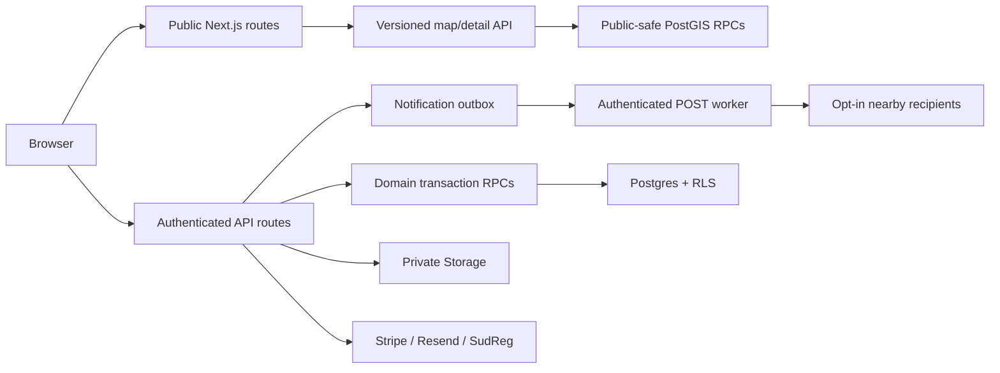

# DajSrce technical implementation and operations guide

**Last updated:** 2026-08-01

**Production:** https://dajsrce.vercel.app

**Repository:** https://github.com/id55854/dajsrce.git

**Authoritative audit:** `PROJECT_WIDE_AUDIT_AND_OPTIMIZATION_PLAN.md`
**Remediation record:** `REMEDIATION_IMPLEMENTATION_STATUS.md`

This document describes the post-audit architecture. Older planning Word/PDF/XLSX files are product inputs, not an authoritative description of the running system.

## 1. Product and stack

DajSrce connects individuals, volunteers, Croatian companies, NGOs and social institutions. The platform supports nationwide discovery, needs and pledges, volunteer events and attendance, company campaigns, subscriptions, verification, receipts, ESG exports, CSR reports and public impact profiles.

- Next.js 15.5 App Router, React 19, strict TypeScript and Tailwind CSS 4.
- Supabase Auth, Postgres, PostGIS, RLS and private Storage.
- Leaflet/react-leaflet for the map.
- Stripe subscriptions, Resend transactional email, SudReg company lookup.
- pdf-lib/fontkit with complete static Noto Sans TTFs; `docx` for editable CSR reports.
- ESLint 9, Vitest and GitHub Actions.

Run locally with `npm install` followed by `npm run dev`. Run the entire repository gate with `npm run check`; run the deploy build with `npm run build`.

## 2. Current architecture

Public requests use a stateless anonymous Supabase client and do not read auth cookies. Middleware runs only on protected route families. Authenticated writes resolve the real user with `auth.getUser()`, authorize the relevant tenant/institution, and then call a service-only transactional RPC for multi-row state changes.

### Source layout

- `src/app`: pages and thin HTTP route adapters.
- `src/components`: interactive UI; map-only Leaflet code stays map-local.
- `src/lib`: validation, authorization, observability and domain helpers.
- `supabase/migrations`: the only authoritative schema/RLS history.
- `scripts`: registry import/geocoding/classification/promotion and read-only benchmarks.
- `.github/workflows/ci.yml`: lint, type generation/check, tests, production dependency audit and build.

## 3. Nationwide location fast path

The retired `/api/institutions` catalogue endpoint returns `410 Gone`. The browser must not fetch a national list.

1. `/api/v1/map/institutions` requires a bounded viewport and validated zoom/filter inputs.
2. `map_institutions_v1` uses indexed public geography and returns clusters below zoom 12 or at most 200 individual public-safe rows. The HTTP contract defaults to 150 features and reports total/truncated state.
3. Public responses include ETags, request IDs and CDN caching.
4. The map debounces viewport changes, aborts old requests, ignores stale responses and keeps at most 60 list rows in the DOM.
5. `/api/v1/institutions/:id` fetches detail only after selection.
6. Hidden institutions return stable coarse coordinates and never return an exact address/directions link. Exact `institutions.location` is private; public filtering uses `public_location` so bounding-box/count inference cannot reveal the source point.

The location migration is `20260801150000_location_fast_path.sql`. A read-only response benchmark is `node scripts/benchmark-map-api.mjs --base-url <origin>`.

Initial operating budgets:

| Signal | Budget |
|---|---:|
| Map response features | <= 200 |
| Map list DOM rows | <= 60 |
| Initial compressed map payload | <= 150 KB |
| Warm map API p95 | <= 300 ms |
| Cold map API p95 | <= 800 ms |
| Browser INP p75 | <= 200 ms |

## 4. Security and authorization model

The release gate is `20260801160000_security_release_gate.sql`.

- `/api/seed` is permanently disabled. Seeding is a local/service-role CLI operation.
- New auth users always start as `individual`; user metadata cannot assign application roles.
- Profile role, institution linkage, company tenant fields, membership roles, domains, registry rows and verification state cannot be forged through direct authenticated-table writes.
- Application roles cannot create objects in `public`; security-definer functions use a locked `pg_catalog`-first search path and explicit grants.
- Anonymous users cannot select the base institution/registry tables. Public map/detail functions return an allow-listed projection.
- Company creation plus owner membership and audit append are atomic.
- Invitation and company-verification bearer values are SHA-256 digests at rest, single use, expiring and bound to the intended verified email/control channel.
- Verification confirmation is a POST mutation and requires authoritative SudReg data plus published-email or DNS-domain control.
- Legacy self-attested company-action writes return `410`; historic items are labelled unverified.
- Cron routes are POST-only, use a 32+ character bearer secret and constant-time digest comparison.
- Demo billing and local fixture fallbacks are forbidden in production by startup validation.
- CSP, HSTS, framing, MIME, referrer and permissions headers are set centrally; the Next image proxy is not an unrestricted relay.

Authorization summary:

| Operation | Required authority |
|---|---|
| Browse public map/detail | anonymous public projection |
| Create need/event | authenticated NGO linked to that institution |
| Deliver pledge | donor or owning NGO, enforced transactionally |
| Acknowledge pledge | owning NGO only |
| Company settings/members | tenant role allow-list |
| Receipts/exports/reports | owner/admin/finance plus feature/tier gate |
| Registry/import/geocoding/promotion | service role only |
| Cron/worker execution | strong bearer secret plus service role |

Never put `SUPABASE_SERVICE_ROLE_KEY`, Stripe/Resend/SudReg secrets, raw invite/verification tokens or exact protected coordinates in logs or client bundles.

## 5. Transactional workflows and evidence

`202608010300_transactional_integrity.sql` supplies service-only state machines:

- `create_pledge_transaction`: locks the need, validates remaining quantity, creates optional company match, updates counters and appends audit evidence atomically.
- delivery and acknowledgement RPCs enforce actor/institution ownership and legal state transitions.
- volunteer signup locks capacity; check-in uses a short-lived hashed event token; checkout is idempotent and creates one bounded hours row.
- Stripe events move through received/processing/succeeded/failed states. Failed handlers can retry; stale processing claims can be reclaimed. Price IDs, not client metadata, determine tiers.
- artifact versions use a locked counter. Receipt/export/CSR rows move through generating/ready/failed; failed uploads are removed and downloads expose only ready rows.
- audit hashes cover the complete event envelope and serialize each company chain.
- uncapped JSON evidence RPCs avoid PostgREST row caps for report generation.

Amounts reconcile in integer cents before rendering. Only acknowledgement-backed pledges count in receipts, reports and public company impact. Automated acknowledgement is explicitly disclosed and does not claim independent tax/legal verification.

### Generated artifacts

- Receipt PDF/XML: multi-page repeated headers, complete line count, XML escaping, exact cent reconciliation and Croatian Unicode.
- CSR PDF/DOCX: complete monthly series, beneficiary/campaign tables, methodology, page numbers and Croatian Unicode.
- PDF generation embeds complete static Noto Sans TTFs. Do not switch back to Fontsource WOFF subsets or fontkit subsetting without rendering in multiple PDF readers.
- `src/lib/artifacts.test.ts` generates long fixtures. QA paths are opt-in environment variables and write only under ignored `tmp/`.

## 6. Asynchronous notifications

`20260801180000_async_notifications_public_metrics.sql` adds a durable outbox:

1. A need/event request calls `enqueue_nearby_notification` with a domain idempotency key and returns after the job is stored.
2. An external scheduler POSTs `/api/cron/process-notification-jobs` with `Authorization: Bearer <CRON_SECRET>`.
3. The worker claims at most 20 rows with `FOR UPDATE SKIP LOCKED`, queries opted-in users through indexed PostGIS, inserts per-user notifications idempotently and completes the job.
4. Failures retry with backoff; stale claims are reclaimable; five failed attempts move to `dead` for operator review.

User coordinates are stored only after explicit action. `location_notifications_enabled` defaults false. Vercel's GET-only cron is intentionally disabled; use a scheduler capable of authenticated POST.

## 7. Registry pipeline

The registry directory is a complete mirror of the official `data.gov.hr` CTS
snapshot and remains intentionally separate from map publication. A row in the
official register is not a DajSrce verification or donation-acceptance claim.

- `registry:sync`: discovers the current CTS CSV through CKAN `package_show`, skips unchanged source metadata, streams a size-bounded temporary file and invokes the importer. GitHub Actions runs this twice daily.
- `registry:import`: computes source SHA-256, validates source identity/dates, stages by source row and commits resumable batches. Every merge captures immutable batch membership plus a lean directory projection. The finalizer publishes in constant time by changing one snapshot pointer, and only when exact source counters reconcile and no row is invalid/unmerged.
- `UDR_ID` is the canonical source identity because every official row has one. OIB is optional and non-unique in the source; missing/duplicated OIB is retained as a warning instead of dropping the organisation.
- Processed staging payloads are deleted after their canonical columns and source hash are committed, preventing a second 100 MB copy from accumulating in PostgreSQL.
- `/organisations` and `/api/v1/organisations` expose all current official rows through allow-listed RPCs with exact totals, Croatian collation, indexed search, filters, deterministic sort and bounded pagination. Base registry tables and derived geocodes remain private.
- `registry:verify` checks public facets, every status count, Croatian ordering, first/deep pages, detail lookup, projection/membership/current-count agreement and anonymous denial of the canonical table.
- The compatibility reconciler aligns the legacy `source_present` flag after atomic publication in timeout-safe batches so geocoding, remapping and promotion see the same snapshot without delaying public cutover.
- After publication, bounded cleanup removes non-current membership/directory projections. Canonical legacy trigram and ineffective city/form composites are absent so full snapshots retain safe storage headroom.
- Unfiltered pages read their exact total from immutable snapshot facets instead of rescanning 71,057 rows, keeping cold deep-page requests below the API statement budget.
- `registry:remap`: keyset-scans and sends bounded classifications to a set-based RPC.
- Classification distinguishes eligibility, category candidates and donation candidates. Cultural, sports, equestrian, hobby and professional entity shapes cannot auto-publish from a broad keyword hit.
- `registry:geocode`: durable pending/in-progress/succeeded/retryable/permanent state, capped attempts/backoff and Nominatim identification/rate limits.
- `registry:promote`: one set-based transaction; only active, valid, strongly classified, street/exact-geocoded rows qualify. Curated content wins. Donation types remain unconfirmed until the organization explicitly confirms them.
- Registry-to-institution promotion still requires a usable OIB plus the existing classification/geocode quality gate. Coverage is computed in the database without a client row cap.

Migrations: `20260801170000_registry_pipeline.sql`, `20260804190000_official_association_directory.sql`, `20260804200000_registry_snapshot_reconciliation.sql`, `20260804203000_atomic_registry_snapshot_visibility.sql`, `20260804210000_registry_snapshot_memberships.sql`, `20260804213000_constant_time_registry_finalize.sql`, `20260804220000_registry_directory_projection.sql`, `20260804223000_registry_compatibility_reconciliation.sql`, `20260804230000_registry_storage_lifecycle.sql` and `20260804233000_registry_count_fast_path.sql`.

## 8. Environment contract

Copy `.env.example` to `.env.local`. Production startup fails for missing/placeholders in required values, HTTP production URLs, weak cron secrets, demo billing or local fixtures.

Required platform values:

- `NEXT_PUBLIC_SUPABASE_URL`, `NEXT_PUBLIC_SUPABASE_ANON_KEY`
- `SUPABASE_SERVICE_ROLE_KEY` (server only)
- `NEXT_PUBLIC_APP_URL` (HTTPS in production)
- `CRON_SECRET` (32+ characters)

The production Supabase organization is currently on the Free plan. The full
snapshot plus temporary in-database rollback copy measured 398 MB after index
consolidation; Free enters read-only mode at 500 MB. Remove the reproducible
rollback `ngo_registry` copy after release verification and upgrade to Pro
before enabling unattended twice-daily imports if guaranteed peak headroom is
required.

Feature integrations require the matching Stripe, Resend and SudReg secrets. Public feature flags are presentation gates, never authorization controls.

## 9. Migration and deployment runbook

Apply these new migrations in order before deploying the application commit:

1. `20260801010000_profiles_locale_default_en.sql`
2. `202608010300_transactional_integrity.sql`
3. `20260801150000_location_fast_path.sql`
4. `20260801160000_security_release_gate.sql`
5. `20260801170000_registry_pipeline.sql`
6. `20260801180000_async_notifications_public_metrics.sql`
7. `20260804190000_official_association_directory.sql`
8. `20260804200000_registry_snapshot_reconciliation.sql`
9. `20260804203000_atomic_registry_snapshot_visibility.sql`
10. `20260804210000_registry_snapshot_memberships.sql`
11. `20260804213000_constant_time_registry_finalize.sql`
12. `20260804220000_registry_directory_projection.sql`
13. `20260804223000_registry_compatibility_reconciliation.sql`
14. `20260804230000_registry_storage_lifecycle.sql`
15. `20260804233000_registry_count_fast_path.sql`

Mandatory release sequence:

1. Take a database backup and record current migration history/policies/grants.
2. Restore the backup into staging and apply all fifteen migrations there.
3. Run RPC/RLS smoke tests for anonymous map/detail, signup/setup, NGO writes, pledges, volunteer tokens/checkout, tenant creation/invites/verification, Stripe retry, report generation and both cron routes.
4. Run `npm ci`, `npm run check`, `npm audit`, `npm run build` and the map benchmark.
5. Set production secrets/flags; configure authenticated POST schedulers.
6. Apply migrations in production during a monitored window, then deploy application code.
7. Watch 5xx rate, map latency/payload/truncation, notification dead jobs, Stripe failed events and artifact failed state.

The production project did not contain `supabase_migrations.schema_migrations`
when these changes were applied through the authorized Management API. Before
switching future deploys to `supabase db push` or Supabase Branching, link the
CLI with the database password and run `supabase migration repair --status
applied <version>` for each already-applied local migration, then confirm local
and remote columns match with `supabase migration list`.

The local workspace lacks a database password/Supabase management token, so migration execution is an external release gate. Do not deploy the application first: new routes deliberately fail closed when RPCs are absent.

Rollback should prefer forward fixes. Reverting application code after these additive/restrictive migrations is unsafe because old clients rely on table privileges that are intentionally revoked. If application rollback is unavoidable, keep the database and deploy a compatibility patch, not the vulnerable pre-gate policies.

## 10. Reliability, privacy and incident operations

Initial objectives:

- availability 99.9% monthly for public discovery and authenticated writes;
- error rate below 1% p95 for core APIs;
- database backup RPO <= 24 hours and restore RTO <= 4 hours;
- quarterly staging restore drill;
- alert on Stripe failed events, notification dead jobs, artifact failed rows, map p95 budget breach and sustained 5xx.

Supabase/Vercel settings must implement automated backups and log/storage retention. Retention owners must define deletion periods for exact user location, raw registry source, audit/evidence records, generated files and expired token rows. User export/deletion must remove or anonymize dependent personal data while retaining only legally required evidence.

Incident minimum:

1. stop the affected worker/feature flag without enabling an insecure fallback;
2. rotate exposed secrets and invalidate affected tokens/sessions;
3. preserve structured request IDs, audit chains and provider event IDs;
4. assess exact-location, company, volunteer and evidence exposure separately;
5. notify the privacy/legal owner; document timeline, scope, remediation and prevention;
6. restore from a verified backup only after root cause is contained.

## 11. Testing and change safety

`npm run check` runs non-interactive ESLint, Next route generation, strict TypeScript and Vitest. Tests cover environment fail-closed behavior, cron/token primitives, structured logging, location validation/privacy/cache contracts, legacy endpoint retirement, strict dates/input validation, migration invariants, OIB/classification false positives and long PDF/DOCX artifacts.

CI additionally runs a production dependency audit and build. Dependabot is configured. Migration filenames must remain unique and sortable. Use additive timestamped migrations; never edit an applied migration to change production state.

Before changing a renderer, generate long Croatian PDF/DOCX samples, render every page, inspect wrapping/repeated headers/footers and reconcile every source row/total. Before changing the map, benchmark payload, feature count, DOM count and hidden-coordinate behavior.
